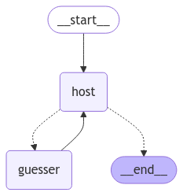
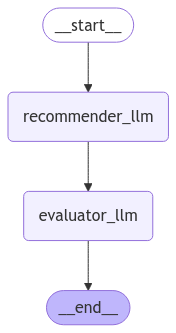
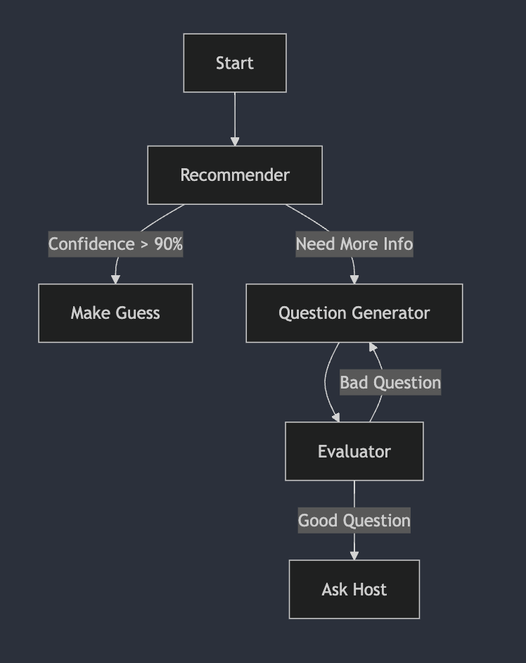

# 20 Questions Game

This is a simple implementation of the 20 Questions game using LangGraph.

## Setup and Run

Run all the following commands in the root directory of the project.

```
pip install -r requirements.txt
```

### Running the Agents Separately

Run the following command to run the v1 agent:

```bash
python agents.v1.agent.py
```

Run the following command to run the v2 agent:

```bash
python agents.v2.agent.py
```

### Running the evaluation

The following command runs the evaluation for all the topics in the `topics.txt` file and for all versions of the agents.

Feel free to change the LLM providers, prompts, etc. in the `evals/evaluation.py` file.

```bash
python evals.evaluation.py
```

## v1: LLM based Host and Guesser

For the initial version, I wanted to keep things simple and only use LLMs.

I kept both the host and the guesser as two nodes in a shared state graph - this means that the shared state is like an agent scratchpad which both the host and the guesser can access.

In v1, I am more focused on setting up a framework for the game, testing different configurations and setting up the evaluation pipeline.



### Host

The host is non deterministic:

- At the start of the game, the host chooses a topic if one is not provided.
- The host answers the guesser's question and also decides if the guess is correct.
- The host deciding if the guess is correct is non deterministic and reduces some amount of reliability.
- Per my experiments, the host LLM deciding if a guess is correct is quite bad and I introduce three versions of prompts to improve the quality of the host's answers.

### Guesser

The guesser is also a simple (non deterministic) LLM:

- The guesser is given the previous conversation history (the question and subsequent answer) as well as the number of questions it has remaining.
- Through prompting, I try to guide the guesser to start guessing the topic as number of questions remaining decreases.

### Prompts

Refer to [prompts.py](agents/v1/prompts.py) for the prompts used in this version.

#### v1: Simple Setup

- [initial_host_prompt_v1](agents/v1/prompts.py#L3): Prompt for the host to choose a topic.
- [host_prompt_v1](agents/v1/prompts.py#L12): Prompt for the host to answer the guesser's question and further decide if the guess is correct.
- [guesser_prompt_v1](agents/v1/prompts.py#L22): Prompt for the guesser to ask a question - simple setup.

_NOTES_:

- Even with prompting, it is hard to determine exactly what is a `correct_guess`.
- The guesser rarely tries to make guesses - it only asks broad questions.

#### v2: Examples in Prompt

- [host_prompt_v2](agents/v1/prompts.py#L44): Adds examples to the host prompt mainly on how to determine if the guess is correct or not.
- [guesser_prompt_v2](agents/v1/prompts.py#L33): Guides the guesser to ask more specific questions as the number of questions remaining decreases.

_NOTES_:

- The host is still not able to determine if a guess is correct.
- I change the prompt to add an instruction for the guesser to guess the topic as number of questions remaining decreases. This results in the guesser asking targeted, specific questions as the number of questions remaining decreases.

#### v3: Analysis

- [host_prompt_v3](agents/v1/prompts.py#L64): The examples in the prompt also contain an analysis of why the guess is correct or not.
- No changes to the guesser prompt.

_NOTES_:

- Asking the host to reason about why a guess is correct or not helps.
- The host is much better at determining if a guess is correct.
- In the next version, we can focus on a deterministic way of determining if a guess is correct.

### Why Shared State?

- In my current implementation, the shared state is not a critical aspect - in the sense that, we could very quickly switch to a setup where the host and guesser are running separately.
- How? The shared state just contains conversation history of messages between the host and the guesser. This can be easily swapped with actual message passing implementations.
- Other metadata like topic, although stored in the shared state, is not used by the guesser (by design).
- However, the shared state implementation is good for prototyping and building the rest of the framework around it.

## v2: Deterministic Host + Multi-Agent / LLM Guesser

The second version introduces significant improvements to make the game more reliable and intelligent:


### Host Improvements

The host has been redesigned to be fully deterministic:

- Instead of relying on LLM judgment for determining correct guesses, the host now uses exact string matching.
- This eliminates the ambiguity and inconsistency issues from v1 where the LLM would sometimes incorrectly validate guesses.
- This change significantly improves the reliability of the game.

### Guesser Architecture

The guesser has been completely redesigned as a multi-agent system composed of two specialized LLMs working together:



#### 1. Recommender LLM

- Analyzes conversation history and generates a list of potential topics/guesses based on previous questions and answers.
- Uses structured output to provide multiple suggestions.
- Helps maintain context and build upon previous information.

#### 2. Evaluator LLM

- Takes recommendations and conversation history to decide the next action
- Can either:
  - Ask a new question to gather more information
  - Make a guess if confidence is high enough
- Uses a sophisticated prompt that helps avoid repetitive questions
- Includes retry logic to prevent getting stuck in loops

### Observations

1. The guesser and host get stuck in a loop when the host gives a slightly incorrect response.
   Example:

- **Topic**: "Tree"
- **Guesser**: Is it a flowering plant?
- **Host**: Yes
- **Guesser**: Is it a bamboo?
- **Host**: No
- **Guesser**: Is it a bamboo?
- **Host**: No
  ...
  and so the loop continues.

2. v2 of the prompt forces the guesser to change the question if it's been askked and answered. The evaluator then stops asking the same question or making the same guess.

3. However, during evaluation, there are cases when the guesser might still repeat the same question cause it is quite sure about the answer. When it gets multiple no's it starts becoming more specific.
   **Example of this scenario **

- **Topic**: "Computer"
- **Guesser**: Is it a laptop?
- **Host**: No
- **Guesser**: Is it a laptop?
- **Host**: No
- **Guesser**: Is it a chromebook?
- **Host**: No

...

**Some possible improvements**

- Add a deterministic check to see if a question has been answered previously.
- Prompt engineer in a way that the guesser searches for similar items.

## v3: Multi-Agent Guesser - inspired from binary search

The base graph over here is the same. 

Main focus is on the guesser node and trying to see if we can add in multi agent collaboration along with the idea of binary search over the candidate pool.


**NOTE**: I haven't been able to test this version completely but I am adding it here as I think this architecture is a good direction to explore and can potentially lead to more deterministic agents as well. 

Example: we can come up with a probabilitic approach of assigning confidence scores to the candidates and use that to make a guess.

More on this is detailed in the [future work](#future-work) section.

### Guesser




The guesser consists of three specialized LLM agents working in concert:

1. **Recommender Agent**
   - Analyzes conversation history and current candidate pool
   - Decides between making a guess or asking another question
   - Maintains confidence scores for each candidate
   - Only recommends guessing when confidence exceeds 90%
   - Example decision flow:
     ```
     History: "Is it a fruit?" -> "Yes"
     Candidates: ["apple", "banana", "cherry"]
     Decision: question (no candidate > 90% confidence)
     ```
2. **Question Generator Agent**
   - Creates binary search style questions to split candidate pool
   - Aims to eliminate approximately half of candidates with each question
   - Tracks expected eliminations and retentions
   - Example:
     ```
     Candidates: ["apple", "banana", "cherry", "dog", "cat"]
     Question: "Is it a living thing?"
     Expected Elimination: ["apple", "banana", "cherry"]
     Expected Retention: ["dog", "cat"]
     ```
3. **Evaluator Agent**
   - Assesses question quality based on:
     1. Effectiveness in splitting candidate pool
     2. Clarity and ambiguity
     3. Overlap with previous questions
     4. Yes/No answerable
   - Provides improvement suggestions for rejected questions

#### Observations

1. The host is not able to answer questions like "Does the topic start with a vowel?"
   Example:

- *Topic*: "Apple"
- *Guesser*: Is it a fruit?
- *Host*: Yes
- *Guesser*: Does it start with a vowel?
- *Host*: No

2. The guesser is not able to effectively eliminate across candidates due to bad responses from the host.

## Common Questions

1. How do we ensure reliability?

**Ans:** On the LLM side, we make use of structured outputs to ensure answers are always Pydantic models. We could've potentially used Prompt Engineering to enforce constraints but this is a much better solution.

2. What all is testable?

**Ans:** There are layers to this answer.

- _Flow of the game_: Just by mocking the LLM calls, we can test the flow of the game and check if the basic functionality is working.
- _Prompt Evaluation_: The scripts in `evals/` can be used to test if the prompts are working as expected and how each change in the prompt affects the accuracy score.
- _LLM Evaluation_: Similar to prompts, we can test how changes in the LLM model being used, even in different providers, affects the accuracy score.

3. How do we ensure that the guesser is not repeating questions?

**Ans:** Currently, we use prompt engineering to guide the guesser to not repeat questions. We can further improve this by adding a deterministic check to see if a question has been answered previously.

4. What are the kinds of error handling we can do?

**Ans:** We do two types of error handling:

- _LLM_: We use structured outputs to ensure that the LLM always returns a Pydantic model. We also add a retry mechanism to retry the LLM call if it doesn't return a valid model or if there is any other runtime error.
- _Evaluations_: In evaluations, we make use of simple `try-except` blocks to ensure that the evaluation script doesn't crash in case the LLM returns something unexpected.

5. Why Langgraph? 

**Ans:** Langgraph is a great choice for quick prototyping and testing different LLM configurations. I wanted to focus on the core logic of the game and try out different LLMs and prompts without having to worry about the underlying framework.

It will be quite easy to swap out Langgraph for any other framework if needed. 


## Future Work

This work primarily focuses on the LLM side of the game. Here are some areas which can potentially improve the guesser / host accuracy:

**Guesser**

1. The goal of the guesser is to minimize entropy and uncertainty in indentifying the host's topic. We can try to model this as an optimization problem and aim to estimate how much each candidate question reduces the entropy.
2. Integrate an English word frequency database to assign probabilities to generated candidates based on their frequency.
3. An early game decision tree mechanism wherein the guesser decides to explore questions based on broad themes and categories to narrow down the search space.
4. There can be themes that the guesser should consider initially and even a deterministic approach is enough to set the stage for the model to have good chance of guessing. The value k=7,10 questions for this deterministic approach can be optimized for.
5. Memory integration - While we already pass message history to the guesser, as we introduce multi agent architecture in the guesser, it is important to have a memory mechanism for storing intermediate results. This will also aid the guesser to make better recommendations.

**Host**

1. Giving the host access to string manipulation `tools` in the context of functions that can be used to get simple information would allow the host to answer questions like "Does the topic start with a vowel?" without guessing.

**Agent Level**

Currently, the guesser and host share the same state and function in the same graph. While this helps to iterate and evaluate various LLMs and prompt configurations, it is not a user friendly setup.

We can design a setup where the guesser and host are separate agents and message passing can occur over a network or any other medium. This is not hard to implement with the current setup also.
